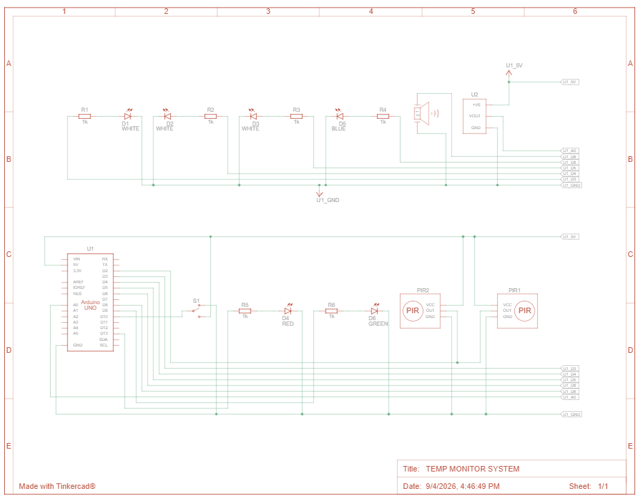

# Control & Server Room Monitoring System

## Overview

This project is an Arduino-based monitoring and control system designed
around a server-room scenario.

The system combines temperature monitoring, movement detection, automated
lighting control and door activity indication.

The project was first designed and validated in Tinkercad Circuits and is
being progressed towards physical hardware implementation.

**Status:** Tinkercad simulation complete | Physical implementation in progress

> **Important:** This README documents the behaviour of the current Version 1
> code. Some features described in the original design concept are listed as
> future improvements where they are not yet implemented in software.

---

## Objectives

- Monitor the server-room temperature.
- Detect low and high temperature conditions.
- Provide visual temperature warnings.
- Provide an audible warning outside the temperature range.
- Detect movement using a PIR sensor.
- Activate lighting when movement is detected.
- Monitor door activity using a reed switch.
- Provide a visual indication of door activity.
- Integrate multiple sensors and outputs using an Arduino Uno.

---

## Current System Behaviour

### Temperature monitoring

The temperature sensor is read through analogue input `A0`.

The software converts the analogue value using:

```cpp
int temp = map(sensor,20,358,-40,125);
```

The current warning states are:

| Temperature | Red LED | Blue LED | Buzzer |
|---|---|---|---|
| `<= 18°C` | OFF | ON | ON |
| `19–23°C` | OFF | OFF | OFF |
| `>= 24°C` | ON | OFF | ON |

Because the low and high checks are evaluated first, exactly `18°C` and
`24°C` are warning states rather than normal states.

### Movement-controlled lighting

The current program reads one PIR input on `D2`.

When `D2` is HIGH:

- `D3` is activated
- `D4` is activated
- `D5` is activated
- the program waits approximately 20 seconds

The Tinkercad schematic contains two PIR modules. The current code directly
reads one PIR input, so this is recorded as a limitation/future improvement.

### Door activity

A reed switch is read through `D10`.

When active, the door indicator LED on `D9` is switched on for approximately
one second and then off for approximately one second.

---

## System Architecture

```text
 Temperature Sensor ─────┐
                         │
 PIR Sensor ─────────────┤
                         │
 Reed Switch ────────────┤
                         v
                    +----------+
                    | Arduino  |
                    |   Uno    |
                    +----+-----+
                         |
          +--------------+--------------+
          |              |              |
          v              v              v
     Warning LEDs     Lighting LEDs    Buzzer
          |
          v
    Door Indicator
```

---

## Hardware

| Component | Quantity | Purpose |
|---|---:|---|
| Arduino Uno | 1 | Main controller |
| PIR motion sensor | 2 in schematic | Movement detection |
| Temperature sensor | 1 | Temperature measurement |
| Reed switch | 1 | Door activity detection |
| Red LED | 1 | High-temperature warning |
| Blue LED | 1 | Low-temperature warning |
| Door/status LED | 1 | Door activity indication |
| Buzzer | 1 | Audible warning |
| Resistors | Multiple | Current limiting |
| Breadboard | 1 | Prototype |
| Jumper wires | Multiple | Connections |

---

## Pin Configuration

| Pin | Function | Direction |
|---|---|---|
| A0 | Temperature sensor | INPUT |
| D2 | PIR sensor input | INPUT |
| D3 | Lighting output | OUTPUT |
| D4 | Lighting output | OUTPUT |
| D5 | Lighting output | OUTPUT |
| D6 | Buzzer | OUTPUT |
| D8 | Blue LED | OUTPUT |
| D9 | Door indicator LED | OUTPUT |
| D10 | Reed switch | INPUT |
| D13 | Red LED | OUTPUT |

---

## Circuit Schematic
---


---

## Tinkercad Simulation

Add your public Tinkercad circuit link below.

**Tinkercad:** `PASTE_YOUR_TINKERCAD_LINK_HERE`

Recommended simulation evidence:

### Low temperature

Show the temperature at or below 18°C with the blue LED and buzzer active.

Save as:

```text
Simulation/temperature_low.png
```

### Normal temperature

Show the warning outputs inactive.

Save as:

```text
Simulation/temperature_normal.png
```

### High temperature

Show the temperature at or above 24°C with the red LED and buzzer active.

Save as:

```text
Simulation/temperature_high.png
```

### Movement detection

Show the PIR input activated and the lighting outputs active.

Save as:

```text
Simulation/occupancy_detected.png
```

### Door activity

Show the reed switch activated and the door indicator responding.

Save as:

```text
Simulation/door_activity.png
```

---

## Source Code

Current Version 1 code:

[Src/server_room_monitoring_code](Src/server_room_monitoring_code)

---

## Physical Implementation

The next stage is to reproduce the simulated circuit using the purchased
hardware kit.

Add photographs here as the build progresses.

### Components

Save:

```text
hardware/components.jpg
```

### Breadboard prototype

Save:

```text
hardware/prototype.jpg
```

### Testing

Save:

```text
hardware/testing.jpg
```

### Final build

Save:

```text
hardware/final_build.jpg
```

---

## Testing

Testing should be performed in both simulation and physical hardware.

The full test record is maintained in:

[testing/test_results.md](testing/test_results.md)

Key tests:

| ID | Test | Expected result |
|---|---|---|
| T01 | Temperature <= 18°C | Blue LED and buzzer active |
| T02 | Temperature 19–23°C | Warning outputs inactive |
| T03 | Temperature >= 24°C | Red LED and buzzer active |
| T04 | PIR movement | Lighting outputs activate |
| T05 | No PIR movement | Lighting outputs return LOW |
| T06 | Reed switch active | Door indicator responds |

---

## Current Limitations

### Two PIR sensors vs one software input

The schematic contains two PIR sensors, but the current program directly reads
only `D2`.

### Blocking delays

The program uses `delay()` for timing. A 20-second delay can prevent the rest
of the control logic from responding immediately.

### Temperature conversion

The `map()` function provides an estimated temperature based on the selected
sensor calibration points. Physical testing is required to determine actual
accuracy.

### Normal-temperature indication

The current code does not provide a dedicated green LED for the normal
temperature state.

### Continuous buzzer

The warning states use `tone()` without an explicit duration. The buzzer
therefore remains active while the warning state remains active.

---

## Planned Improvements

- Process both PIR sensors independently.
- Replace blocking `delay()` calls with `millis()` timing.
- Add a dedicated normal-temperature indicator.
- Add temperature hysteresis to prevent rapid switching around thresholds.
- Calibrate the temperature sensor against a reference thermometer.
- Add an LCD/OLED status display.
- Add data logging.
- Add sensor fault detection.
- Improve door-state handling.
- Develop a custom PCB and enclosure.

---

## Development Process

```text
Requirements
    ↓
Component selection
    ↓
Circuit design
    ↓
Arduino software
    ↓
Tinkercad simulation
    ↓
Simulation testing
    ↓
Physical prototype
    ↓
Hardware testing
    ↓
Measurements
    ↓
Design improvements
```

---

## Skills Demonstrated

- Embedded programming
- Arduino development
- Analogue sensor interfacing
- Digital sensor interfacing
- PIR motion detection
- Temperature monitoring
- Reed-switch interfacing
- Digital input/output
- Conditional logic
- Automated control
- Timing
- LED and buzzer control
- Circuit design
- Tinkercad simulation
- Hardware prototyping
- System testing
- Technical documentation
